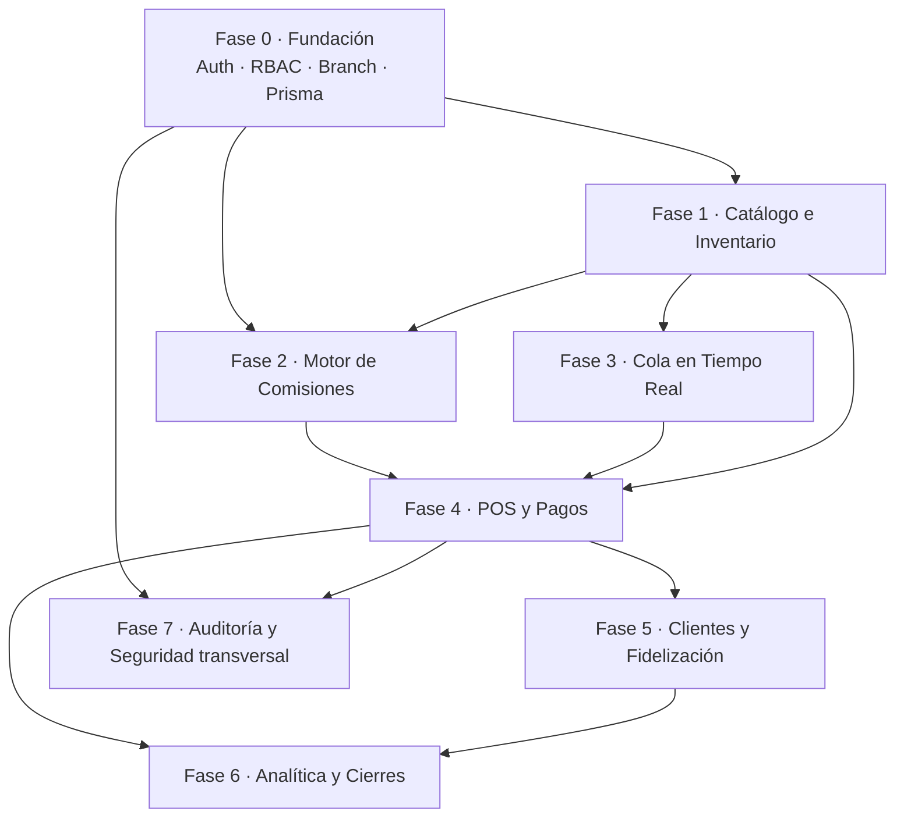

# Barber Studio — Roadmap del Backend

> Documento de planificación de alto nivel. Cada fase tiene su plan detallado en `docs/modules/`.
> Stack: **NestJS 11 + Prisma 7 + PostgreSQL 16** · Monorepo pnpm · Arquitectura **multi-sucursal** (una empresa, una DB).

**Última actualización:** 2026-06-15

---

## Principio de secuenciación

Las fases NO siguen el orden del documento de negocio, sino el **orden de dependencia técnica**: cada fase produce software funcional y testeable que habilita la siguiente. No se puede emitir un ticket sin catálogo; no se puede calcular comisión sin el motor de reglas; no hay Z-Report sin pagos.

---

## Fases

| Fase | Módulo de negocio | Entrega clave | Depende de | Plan |
|------|-------------------|---------------|------------|------|
| **0** | Infra + Mód. 6 (base) | Auth JWT, guard de roles, modelo `Branch`, `PrismaService` con adapter, seed inicial | — | [00-foundation](modules/00-foundation.md) |
| **1** | Mód. 4 — Inventario y Catálogo | CRUD de servicios/categorías/productos, stock por sucursal, ledger de movimientos | 0 | [01-catalog-inventory](modules/01-catalog-inventory.md) |
| **2** | Mód. 3 — Motor de Comisiones | `Setting` global/sucursal, reglas con prioridad y vigencia, **servicio de resolución** | 0, 1 | [02-commissions](modules/02-commissions.md) |
| **3** | Mód. 1 — Operaciones en Tiempo Real | Cola (general/asignada), gateway WebSocket, "Mi Rendimiento" | 0, 1 | [03-queue-realtime](modules/03-queue-realtime.md) |
| **4** | Mód. 2 — POS y Flujo de Caja | Tickets con snapshot de comisión + IGV, pago dividido, propinas, caja, recepción reactiva | 1, 2, 3 | [04-pos-payments](modules/04-pos-payments.md) |
| **5** | Mód. 5 (parte) — Clientes | `Customer`, ledger de fidelización, acumulación/canje de puntos | 4 | [05-customers-loyalty](modules/05-customers-loyalty.md) |
| **6** | Mód. 5 (parte) — Analítica y Cierres | Z-Report (arqueo por método + pago a barberos), métricas | 4, 5 | [06-reports-closing](modules/06-reports-closing.md) |
| **7** | Mód. 6 — Seguridad transversal | Auditoría de use-cases (`AuditLog`), hardening RBAC por sucursal | 0, 4 | [07-security-audit](modules/07-security-audit.md) |
| **8** | Frontend — Portal del Barbero | App Next.js 16, cola reactiva, creación de tickets, widget de rendimiento | 3, 4 | [08-frontend-barber-portal](modules/08-frontend-barber-portal.md) |
| **9** | Frontend — Estación POS y Caja | Estación POS, apertura/cierre de caja, pago dividido, propinas y vuelto | 4, 8 | [09-frontend-pos-station](modules/09-frontend-pos-station.md) |
| **10** | Frontend — Backoffice Catálogo e Inventario | Gestión de servicios, categorías, productos retail, stock por sucursal y movimientos | 1, 9 | [10-frontend-admin-catalog-inventory](modules/10-frontend-admin-catalog-inventory.md) |
| **11** | Frontend — Personal, Sedes y Comisiones | Cuentas de equipo, gestión de sedes, motor jerárquico de comisiones y simulador | 2, 10 | [11-frontend-admin-staff-commissions](modules/11-frontend-admin-staff-commissions.md) |
| **12** | Frontend — Clientes y Fidelización | Directorio unificado, libro mayor de puntos, canje en tiempo real e historial | 5, 11 | [12-frontend-admin-customers-loyalty](modules/12-frontend-admin-customers-loyalty.md) |

---

## Milestones

- **M1 — Catálogo operable** (fin Fase 1): se pueden cargar servicios y productos con stock. *Demo: seed + listado por sucursal.*
- **M2 — Venta de punta a punta** (fin Fase 4): un barbero crea un ticket, el POS lo cobra (dividido, con IGV y propina), se descuenta stock y se calcula la comisión. *Demo principal de valor.*
- **M3 — Cierre de día** (fin Fase 6): Z-Report cuadra ingresos por método y calcula el pago a cada barbero. *Demo a la dueña.*
- **M4 — Producción** (fin Fase 7): auditoría activa y accesos endurecidos.

---

## Convenciones transversales (aplican a todas las fases)

- **TDD**: test que falla → implementación mínima → test que pasa → commit. Ver cada plan de módulo.
- **DTOs + validación**: `class-validator` en cada endpoint; nunca confiar en el body crudo.
- **Multi-sucursal**: cada query de datos operativos filtra por `branchId`; el guard inyecta la sucursal del usuario (OWNER puede pasar `branchId` explícito).
- **Dinero**: siempre `Prisma.Decimal`, nunca `number`. Redondeo a 2 decimales en el borde (capa de servicio), no en la DB.
- **Inmutabilidad**: tickets, pagos, movimientos de stock y puntos son ledgers — se anulan con estado/contra-asiento, no se editan ni borran.
- **Soft-delete**: catálogo, clientes, usuarios y sucursales usan `deletedAt`; las queries excluyen borrados por defecto (middleware Prisma).

---

## Cómo ejecutar cada fase

Cada documento en `docs/modules/` es un plan de implementación con tareas en checkbox (`- [ ]`). Para llevarlo a código, usar la skill `superpowers:subagent-driven-development` (un subagente por tarea con review) o `superpowers:executing-plans` (ejecución por lotes con checkpoints).
