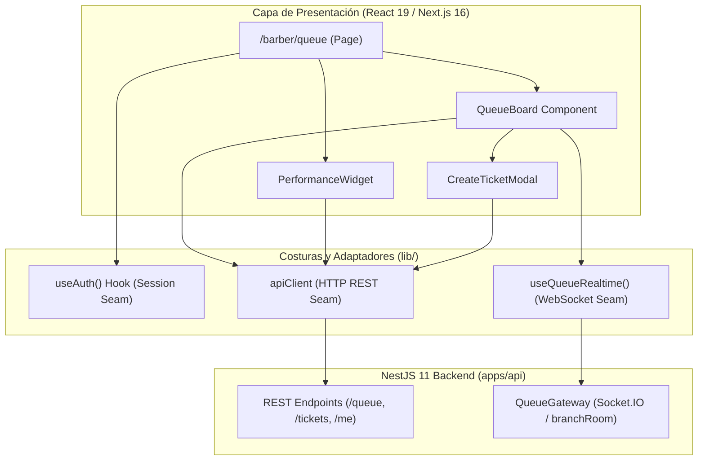

# Fase 8 — Frontend: Arquitectura Base y Portal del Barbero

> **Stack:** Next.js 16 (App Router), React 19, Tailwind CSS 4, Socket.IO Client.
> **Enfoque de diseño:** Deep Modules (Matt Pocock Skills), Seams & Adapters, Mobile-First / PWA.

---

## 1. Visión y Alcance

El **Portal del Barbero** es la herramienta operativa táctica que el barbero utiliza desde su smartphone, tablet o estación de corte. Su propósito es:
1. Visualizar en tiempo real el flujo de clientes (Cola General y Cola Asignada).
2. Transicionar turnos sin colisiones ni condiciones de carrera (`Tomar cliente` → `Iniciar servicio` → `Generar ticket y completar`).
3. Crear el ticket de venta asociado al cliente/turno con snapshot de precios y servicios realizados.
4. Monitorear en tiempo real su métrica del turno (**Mi Rendimiento**: cortes completados, propinas y comisiones devengadas).

---

## 2. Arquitectura de Módulos y Costuras (*Seams & Adapters*)

Diseñado siguiendo el principio de **Módulos Profundos** (*Deep Modules*): interfaces mínimas con alta capacidad y complejidad interna aislada.

### A. Costura HTTP (`apps/web/src/lib/api/`)
* **Módulo:** `apiClient`
* **Interfaz:** Métodos fuertemente tipados (`auth.login`, `queue.list`, `queue.changeStatus`, `queue.assign`, `performance.get`, `tickets.create`).
* **Profundidad:** Inyecta automáticamente el JWT almacenado, gestiona cabeceras `Authorization: Bearer`, serializa queries y normaliza errores de la API (`401 Unauthorized`, `403 Forbidden`, `400 BadRequest`) en un formato predecible.

### B. Costura WebSocket (`apps/web/src/lib/realtime/`)
* **Módulo:** `useQueueRealtime(branchId)`
* **Interfaz:** `{ entries, isConnected, refresh }`.
* **Profundidad:** Maneja el ciclo de vida de la conexión `socket.io-client`, suscripción a la sala `branch:<branchId>`, reconexión exponencial y actualización reactiva de la lista de turnos cuando se recibe el evento `queue.updated`.

### C. Costura de Sesión (`apps/web/src/lib/auth/`)
* **Módulo:** `useAuth()` / `AuthProvider`
* **Interfaz:** `{ user, token, login, logout, isAuthenticated }`.
* **Profundidad:** Persistencia segura de credenciales, decodificación de rol (`Role.BARBER`), extracción de `branchId` activo y protección de rutas.

---

## 3. Especificación de Pantallas y Componentes

### 3.1. Tablero de Cola (`QueueBoard`)
* **Layout:** Vista mobile-first optimizada para uso ágil con una mano en el sillón de barbería.
* **Secciones:**
  1. **Turno Activo (En Progreso):** Tarjeta destacada con el cliente que el barbero está atendiendo actualmente. Botón principal: `Terminar y Cobrar` (abre `CreateTicketModal`).
  2. **Cola Asignada a Mí:** Clientes que solicitaron explícitamente a este barbero.
  3. **Cola General:** Clientes en espera que cualquier barbero libre puede tomar (`Tomar siguiente`).
* **Acciones de Turno:**
  * `Tomar cliente`: Asigna al barbero y cambia estado a `IN_PROGRESS`.
  * `Cancelar turno`: Confirmación rápida para clientes que se retiran.

### 3.2. Modal de Generación de Ticket (`CreateTicketModal`)
* **Propósito:** Al completar el corte, el barbero selecciona los servicios y productos entregados.
* **Inputs:**
  * Selector multi-categoría de servicios (Corte Clásico, Barba, Perfilado, etc.).
  * Adición de productos retail si el barbero vendió alguno (Cera, Aceite, etc.).
  * Campo opcional de propina (`tipAmount`).
* **Acción:** Envía `POST /tickets`, lo que transiciona la entrada de la cola a `COMPLETED` y emite `ticket.created` en tiempo real a la caja (POS).

### 3.3. Barra de Rendimiento del Turno (`PerformanceBar`)
* **Propósito:** Feedback motivacional inmediato para el barbero.
* **Métricas mostradas:**
  * Cortes completados en el turno.
  * Total de propinas acumuladas en el día.
  * Comisión devengada estimada (calculada deterministamente por el backend).

---

## 4. Plan de Implementación por Pasos

- [ ] **Paso 8.1 — Dependencias e Infraestructura de Cliente**:
  - Instalar `socket.io-client` y `lucide-react` en `apps/web`.
  - Crear variables de entorno (`.env.local` con `NEXT_PUBLIC_API_URL` y `NEXT_PUBLIC_WS_URL`).
- [ ] **Paso 8.2 — Cliente de API y Manejo de Auth**:
  - Implementar `apps/web/src/lib/api/client.ts` con tipos derivados de DTOs del backend.
  - Implementar `AuthProvider` y formulario de Login (`/login`).
- [ ] **Paso 8.3 — Hook de Tiempo Real (`useQueueRealtime`)**:
  - Conexión Socket.IO con token JWT hacia el backend.
  - Manejo del evento `queue.updated` y sincronización de estado local.
- [ ] **Paso 8.4 — Componentes del Portal del Barbero**:
  - Componente de tarjeta de turno y cola general/asignada.
  - Componente `PerformanceWidget` (consumo de `/me/performance`).
  - Modal reactivo de selección de catálogo y creación de ticket (`/tickets`).
- [ ] **Paso 8.5 — Verificación y Feedback Loop**:
  - Prueba de flujo de punta a punta: Barbero toma cliente de la cola → genera ticket → actualización instantánea vía WebSockets y actualización de métricas de rendimiento.
