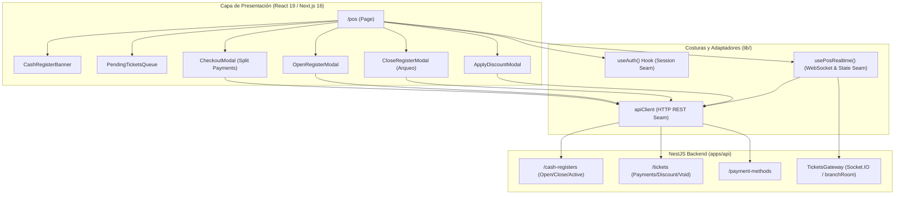

# Fase 9 — Frontend: Estación de Cobro y Punto de Venta (POS)

> **Stack:** Next.js 16 (App Router), React 19, Tailwind CSS 4, Socket.IO Client.
> **Enfoque de diseño:** Deep Modules (Matt Pocock Skills), Seams & Adapters, Mobile-First / Desktop POS.

---

## 1. Visión y Alcance

La **Estación de Cobro y POS** (`/pos`) es el centro de liquidación operativa de la barbería para recepcionistas y administradores (`CASHIER`, `OWNER`). Permite:
1. **Control del Cajón de Dinero:** Apertura con fondo inicial de sencillo (`openingAmount`) y cierre de turno con conteo físico ciego (`closingCountedCash` / Arqueo).
2. **Recepción Reactiva:** Transmisión en tiempo real vía Socket.IO (`ticket.created`, `ticket.updated`, `ticket.paid`, `ticket.voided`) de los tickets emitidos por los barberos.
3. **Liquidación y Pago Dividido:** Cobro multi-método (Efectivo, Tarjeta, Yape, Plin), desglose de IGV (18%), registro de propinas 100% para el barbero y cálculo instantáneo de vuelto en efectivo.
4. **Descuento Manual y Anulación:** Aplicación de descuentos antes de liquidar y anulación protegida por auditoría para el dueño (`OWNER`).

---

## 2. Arquitectura de Módulos y Costuras (*Seams & Adapters*)

---

## 3. Especificación de Componentes

### 3.1. Barra de Sesión de Caja (`CashRegisterBanner`)
* **Estado Abierta:** Muestra fondo inicial en efectivo (S/), hora de apertura del turno, cajero responsable y botón para iniciar el arqueo y cierre (`Cerrar Turno`).
* **Estado Cerrada:** Alerta en color ámbar avisando que no se pueden procesar cobros hasta registrar la apertura, con botón directo `Abrir Caja`.

### 3.2. Cola de Tickets Pendientes (`PendingTicketsQueue`)
* **Filtros rápidos:** Todos, Abiertos (`OPEN`), Pagos Parciales (`PARTIALLY_PAID`).
* **Buscador:** Filtrado instantáneo por código de ticket (`TK-2026-0001`).
* **Tarjetas:** Muestra hora de emisión, total, desglose (subtotal, descuento, IGV), y botones de acción: `Cobrar`, `Descuento` y `Anular` (solo dueño).

### 3.3. Modal de Cobro y Pago Dividido (`CheckoutModal`)
* **Desglose completo:** Carga el detalle con items de servicios y productos retail.
* **Historial de abonos:** Visualiza abonos previos si el cliente ya pagó una parte (e.g. S/ 20 en Yape).
* **Monto flexible:** Permite pagar el saldo total o registrar un monto parcial con botones rápidos (S/ 10, S/ 20, S/ 50, S/ 100).
* **Calculadora de Vuelto:** Al seleccionar Efectivo, ingresa el dinero entregado por el cliente y calcula el vuelto a entregar en tiempo real.

---

## 4. Criterios de Aceptación Cumplidos

- [x] Un cajero puede abrir caja con fondo inicial en soles.
- [x] Sin caja abierta, el botón de cobro está bloqueado proactivamente.
- [x] Al generarse un ticket en la cola del barbero, aparece instantáneamente en el POS.
- [x] Pago dividido probado: permite cobrar parte con Yape y el saldo con Efectivo.
- [x] Al pagar en efectivo, calcula y muestra el vuelto a entregar.
- [x] Al completar el pago, el ticket sale de la cola de pendientes y el stock del producto disminuye en el backend.
- [x] Cierre de caja con conteo físico (arqueo) registrado en base de datos.
