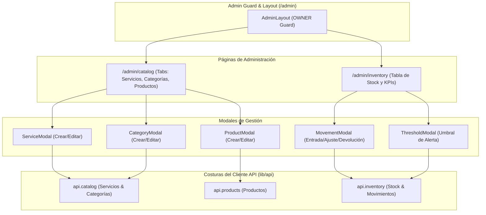

# Fase 10 — Frontend: Backoffice de Catálogo e Inventario

> **Stack:** Next.js 16 (App Router), React 19, Tailwind CSS 4, Turbopack.
> **Enfoque de diseño:** Deep Modules (Matt Pocock Skills), Seams & Adapters, Master-Detail Tables.

---

## 1. Visión y Alcance

El **Backoffice de Catálogo e Inventario** (`/admin/catalog` y `/admin/inventory`) proporciona a los dueños y administradores (`OWNER`) control total sobre la oferta comercial y existencias físicas de la cadena de barberías:
1. **Catálogo Maestro (`/admin/catalog`):**
   - **Servicios:** Creación, edición, precios en soles (S/), duración estimada en minutos, categoría y estado activo/inactivo.
   - **Categorías:** Agrupación visual (Cortes, Barba, Tratamientos, etc.).
   - **Productos Retail:** Gestión de productos para reventa (pomadas, aceites, fijadores) con SKU, precio de venta, costo de compra y cálculo de margen de ganancia.
2. **Control de Inventario por Sucursal (`/admin/inventory`):**
   - Selector multisede para ver existencias por local.
   - Monitoreo de stock físico en tiempo real y alertas de stock bajo (`quantity <= lowStockThreshold`).
   - Registro auditado de movimientos de mercadería (`PURCHASE`, `ADJUSTMENT`, `RETURN`) con notas de referencia.
   - Configuración de umbral de seguridad por producto.

---

## 2. Arquitectura de Módulos y Costuras (*Seams & Adapters*)

---

## 3. Criterios de Aceptación Cumplidos

- [x] Acceso protegido exclusivamente para usuarios con rol `OWNER`.
- [x] CRUD completo de servicios de barbería con validación de duración mínima y precios.
- [x] CRUD completo de categorías de servicios con contador de servicios asociados.
- [x] CRUD completo de productos retail con SKU y visualización de margen comercial.
- [x] Visualización de stock por sucursal con alertas visuales de stock crítico.
- [x] Registro de movimientos de inventario con actualización atómica de balance y auditoría en backend.
- [x] Configuración de umbrales mínimos de stock por producto.
