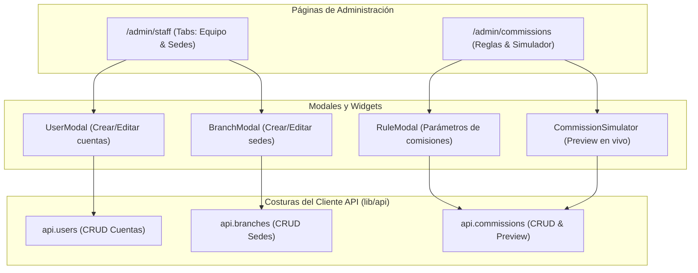

# Fase 11 — Frontend: Backoffice de Personal, Sucursales y Comisiones

> **Stack:** Next.js 16 (App Router), React 19, Tailwind CSS 4, Turbopack.
> **Enfoque de diseño:** Deep Modules (Matt Pocock Skills), Seams & Adapters, Resolution Preview Simulator.

---

## 1. Visión y Alcance

El **Backoffice de Personal, Sucursales y Motor de Comisiones** (`/admin/staff` y `/admin/commissions`) proporciona a los dueños y directores (`OWNER`) control sobre la estructura del equipo y las reglas de compensación:
1. **Personal y Barberos (`/admin/staff`):**
   - Gestión de cuentas de usuario con roles diferenciados (`BARBER`, `CASHIER`, `OWNER`).
   - Asignación de sucursales a barberos y cajeros.
   - Activación, desactivación y actualización de contraseñas.
2. **Red de Sucursales (`/admin/staff` tab Sedes):**
   - Alta, baja y edición de sedes físicas con dirección y teléfono.
   - Control de miembros del equipo asignados por sede.
3. **Motor de Reglas de Comisiones (`/admin/commissions`):**
   - Configuración de comisiones porcentuales (`%`) o montos fijos (`S/`).
   - Jerarquía de especificidad y prioridad (`P-0`, `P-10`, `P-20`...) por barbero, servicio, producto, categoría o sucursal.
   - Fechas de vigencia temporal (`startsAt`, `endsAt`).
   - **Simulador Interactivo:** Prueba en vivo contra el motor del backend (`POST /commission-rules/preview`) para anticipar la resolución exacta antes de emitir tickets.

---

## 2. Arquitectura de Módulos y Costuras (*Seams & Adapters*)

---

## 3. Criterios de Aceptación Cumplidos

- [x] Gestión integral de usuarios con validación de roles y sucursales.
- [x] Gestión de sedes físicas con estado operativo.
- [x] Creación de reglas de comisión porcentuales y fijas con orden de prioridad.
- [x] Filtros de ámbito jerárquico (Barbero > Servicio > Categoría > Producto > Sucursal > Global).
- [x] Simulador interactivo que ejecuta el use-case de resolución de comisiones en tiempo real.
