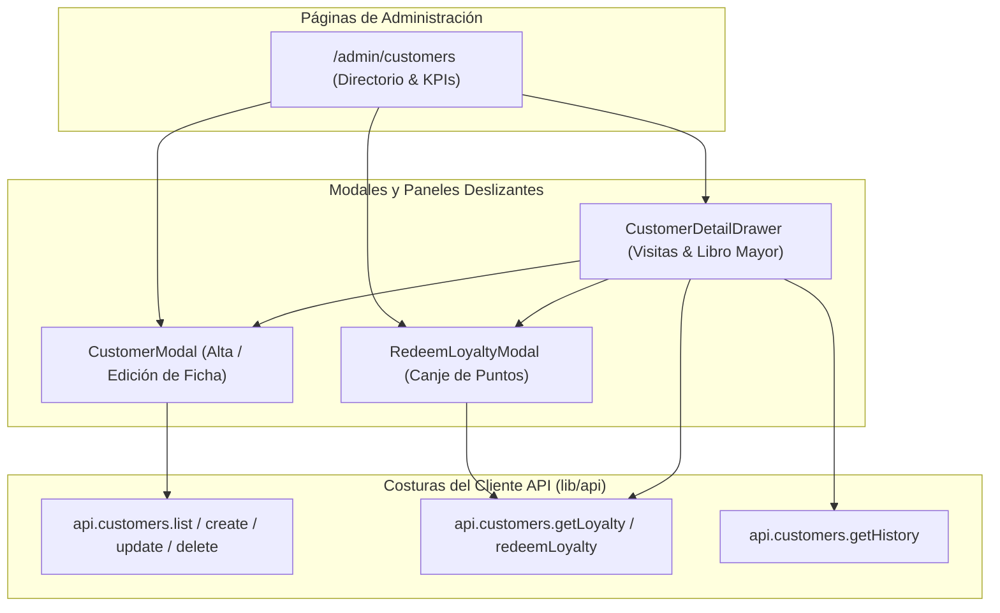

# Fase 12 — Frontend: Backoffice de Clientes y Fidelización

> **Stack:** Next.js 16 (App Router), React 19, Tailwind CSS 4, Turbopack.
> **Enfoque de diseño:** Deep Modules (Matt Pocock Skills), Seams & Adapters, Libro Mayor de Fidelización en Tiempo Real.

---

## 1. Visión y Alcance

El **Backoffice de Clientes y Fidelización** (`/admin/customers`) proporciona a la administración (`OWNER`) una vista 360° de la cartera de clientes, con seguimiento de su historial de atención y administración de su saldo de puntos de lealtad:

1. **Directorio Unificado de Clientes (`/admin/customers`):**
   - Búsqueda en tiempo real por nombre, número de teléfono o correo electrónico.
   - Filtros avanzados por sede preferida, estado de cuenta (activo/inactivo) y tenencia de puntos acumulados.
   - Resumen de métricas clave (Total clientes registrados, saldo en circulación, clientes frecuentes).
2. **Ficha del Cliente y Preferencias:**
   - Registro de datos de contacto y sede habitual.
   - Cuaderno de notas y preferencias de servicio (cortes favoritos, estilos, alergias, indicaciones especiales).
3. **Libro Mayor de Puntos (*Loyalty Ledger*):**
   - Visualización detallada de asientos de crédito (acumulación por cobro de tickets en POS) y débito (canjes).
   - Saldo acumulado en tiempo real (`runningBalance`).
   - Modal de canje directo con validación de saldo disponible y registro de motivo.
4. **Historial de Visitas y Facturación:**
   - Listado de tickets previos con detalle de servicios, productos, fecha de atención y montos.

---

## 2. Arquitectura de Módulos y Costuras (*Seams & Adapters*)

---

## 3. Componentes Implementados

- [`apps/web/src/types/api.ts`](file:///home/rafael/barber-studio/apps/web/src/types/api.ts): Interfaces de dominio `Customer`, `CreateCustomerDto`, `UpdateCustomerDto`, `LoyaltyLedgerEntry`, `CustomerLoyaltyData`, `RedeemLoyaltyDto`.
- [`apps/web/src/lib/api/client.ts`](file:///home/rafael/barber-studio/apps/web/src/lib/api/client.ts): Métodos del cliente `api.customers` para listado, obtención, mutación, historial de visitas y libro mayor de puntos.
- [`apps/web/src/app/admin/layout.tsx`](file:///home/rafael/barber-studio/apps/web/src/app/admin/layout.tsx): Acceso directo a `/admin/customers` con indicador activo.
- [`apps/web/src/features/admin/customers/customer-modal.tsx`](file:///home/rafael/barber-studio/apps/web/src/features/admin/customers/customer-modal.tsx): Modal de alta y edición con validación de campos, asignación de sede preferida y notas especiales.
- [`apps/web/src/features/admin/customers/redeem-loyalty-modal.tsx`](file:///home/rafael/barber-studio/apps/web/src/features/admin/customers/redeem-loyalty-modal.tsx): Modal de canje con presets rápidos de puntos, validación de tope de saldo y registro de motivos.
- [`apps/web/src/features/admin/customers/customer-detail-drawer.tsx`](file:///home/rafael/barber-studio/apps/web/src/features/admin/customers/customer-detail-drawer.tsx): Panel lateral con pestañas de visitas y movimientos del libro mayor de puntos en tiempo real.
- [`apps/web/src/app/admin/customers/page.tsx`](file:///home/rafael/barber-studio/apps/web/src/app/admin/customers/page.tsx): Página principal con métricas KPI, filtros cruzados, tabla interactiva y acciones rápidas.

---

## 4. Tareas del Módulo

- [x] Extender tipos de dominio en `types/api.ts` para clientes y fidelización.
- [x] Implementar costura `api.customers` en el cliente HTTP (`lib/api/client.ts`).
- [x] Actualizar barra de navegación de administración (`/admin/customers`).
- [x] Desarrollar modal de creación y edición `CustomerModal`.
- [x] Desarrollar modal de canje de puntos de fidelización `RedeemLoyaltyModal`.
- [x] Desarrollar panel deslizante `CustomerDetailDrawer` con historial de visitas y libro mayor.
- [x] Desarrollar página principal `/admin/customers` con métricas, búsqueda y filtros.
- [x] Ejecutar suite de pruebas unitarias (`pnpm --filter api test`) y verificación de compilación (`pnpm --filter web build` y `lint`).
