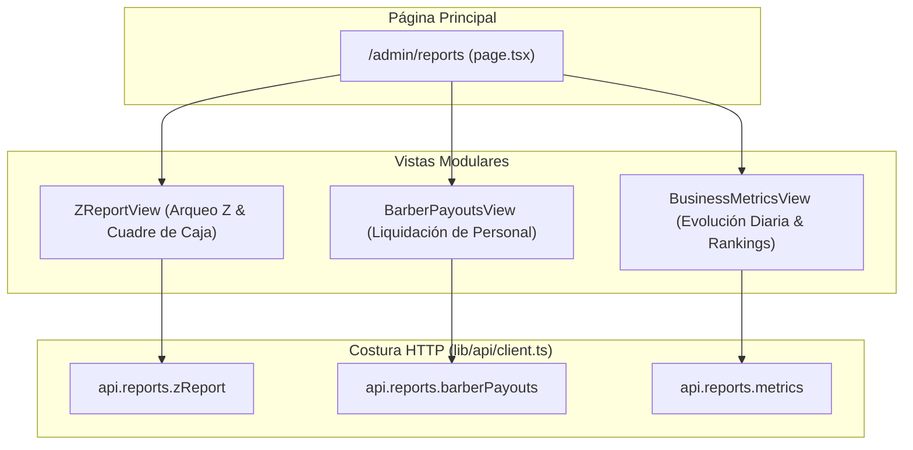

# Fase 13 — Frontend: Reportes Financieros, Z-Report y Analítica de Negocio

> **Stack:** Next.js 16 (App Router), React 19, Tailwind CSS 4, Turbopack.
> **Enfoque de diseño:** Deep Modules (Matt Pocock Skills), Seams & Adapters, Conciliación de Caja y Métricas Visuales.

---

## 1. Visión y Alcance

El **Módulo de Reportes Financieros, Arqueo Z y Analítica** (`/admin/reports`) proporciona al Propietario (`OWNER`) y Dirección una consola unificada de control económico y toma de decisiones:

1. **Arqueo Z-Report (`/admin/reports` tab `z-report`):**
   - Conciliación de caja diaria o por turno de caja física.
   - Desglose contable: Subtotal, Descuentos, Impuestos retenidos (IGV), Propinas y Total Neto Facturado.
   - Arqueo de efectivo en gaveta: Fondo de apertura + Ventas en efectivo = Efectivo esperado vs Efectivo contado (identificación automática de caja cuadrada, sobrante o faltante).
   - Ventas por método de pago (Efectivo, Yape, Plin, Tarjeta...) con cálculo de porcentaje de participación.
   - Liquidación de comisiones del turno y soporte de impresión en formato limpio (`window.print()`).
2. **Liquidación a Barberos (`/admin/reports` tab `payouts`):**
   - Selección por rango de fechas (presets de 7, 15, 30 días o fechas personalizadas) y sede física.
   - Consolidación de comisiones devengadas por servicios/productos y propinas entregadas.
   - Tabla detallada por miembro del equipo y total consolidado de la empresa.
3. **Analítica de Negocio (`/admin/reports` tab `metrics`):**
   - Evolución diaria de facturación y volumen de tickets atendidos mediante gráfico interactivo de barras proporcionales.
   - Ranking de los 10 servicios más solicitados con volumen de atención y recaudación generada.
   - Podio de productividad de barberos ordenado por volumen de ingresos y propinas.

---

## 2. Arquitectura de Módulos y Costuras (*Seams & Adapters*)

---

## 3. Componentes Implementados

- [`apps/web/src/types/api.ts`](file:///home/rafael/barber-studio/apps/web/src/types/api.ts): Contratos de datos de reporte (`ZReportData`, `BarberPayoutsReport`, `BusinessMetricsReport`, `IncomeByMethod`, `TicketTotals`, `CashReconciliation`, `BarberPayout`, `DailyVolume`, `TopService`).
- [`apps/web/src/lib/api/client.ts`](file:///home/rafael/barber-studio/apps/web/src/lib/api/client.ts): Módulo `api.reports` con métodos `zReport`, `barberPayouts` y `metrics`.
- [`apps/web/src/app/admin/layout.tsx`](file:///home/rafael/barber-studio/apps/web/src/app/admin/layout.tsx): Acceso en la barra de navegación "Reportes y Cierres".
- [`apps/web/src/features/admin/reports/z-report-view.tsx`](file:///home/rafael/barber-studio/apps/web/src/features/admin/reports/z-report-view.tsx): Vista completa de Arqueo Z con cuadre de efectivo, métodos de pago y modo de impresión.
- [`apps/web/src/features/admin/reports/barber-payouts-view.tsx`](file:///home/rafael/barber-studio/apps/web/src/features/admin/reports/barber-payouts-view.tsx): Vista de liquidación de comisiones con selector de periodos rápidos.
- [`apps/web/src/features/admin/reports/business-metrics-view.tsx`](file:///home/rafael/barber-studio/apps/web/src/features/admin/reports/business-metrics-view.tsx): Vista analítica con gráfico de evolución diaria y rankings.
- [`apps/web/src/app/admin/reports/page.tsx`](file:///home/rafael/barber-studio/apps/web/src/app/admin/reports/page.tsx): Pestañas de navegación e integración con el selector de sucursales.

---

## 4. Tareas del Módulo

- [x] Modelar interfaces de dominio para reportes en `types/api.ts`.
- [x] Agregar costura `api.reports` en `lib/api/client.ts`.
- [x] Agregar enlace `/admin/reports` en `AdminLayout`.
- [x] Implementar vista de Arqueo Z-Report `ZReportView` con soporte para impresión.
- [x] Implementar vista de liquidaciones `BarberPayoutsView` con presets de fechas.
- [x] Implementar vista de analítica `BusinessMetricsView` con gráfico de barras y rankings de servicios/barberos.
- [x] Implementar contenedor de página `/admin/reports/page.tsx`.
- [x] Ejecutar suite de pruebas unitarias (`pnpm --filter api test`) y compilación Next.js (`pnpm --filter web build` y `lint`).
