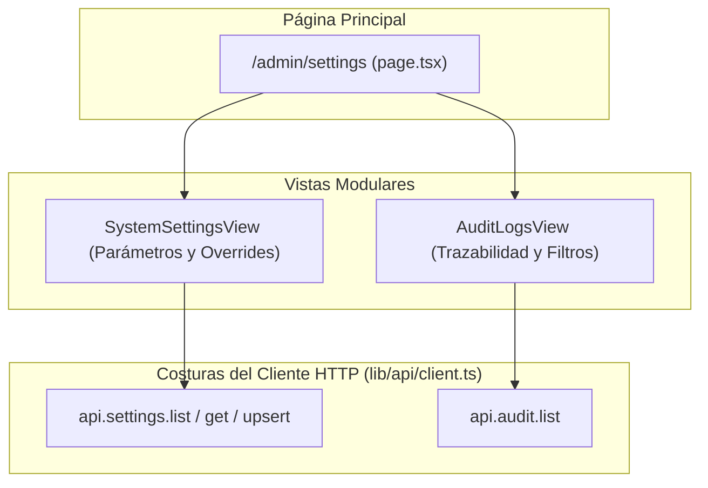

# Fase 14 — Frontend: Configuración Global del Sistema y Registro de Auditoría

> **Stack:** Next.js 16 (App Router), React 19, Tailwind CSS 4, Turbopack.
> **Enfoque de diseño:** Deep Modules (Matt Pocock Skills), Seams & Adapters, Trazabilidad Inmutable y Ajuste Paramétrico.

---

## 1. Visión y Alcance

El **Módulo de Configuración y Auditoría** (`/admin/settings`) cierra la cobertura completa de la plataforma al dotar a la Administración General (`OWNER`) de control sobre las variables de negocio y visibilidad total sobre las acciones críticas realizadas en el sistema:

1. **Parámetros Maestros del Sistema (`/admin/settings` tab Parámetros):**
   - **Tasa de Impuesto / IGV (`tax_rate`):** Porcentaje tributario aplicado al cálculo de tickets en POS.
   - **Comisión Base General (`commission_base_percentage`):** Porcentaje de comisión estándar aplicable cuando no existe una regla específica de mayor prioridad.
   - **Cálculo de Comisión (`commission_base`):** Base de cálculo (`pre_tax` antes de impuestos o `post_tax`).
   - **Ratio de Fidelización (`loyalty_points_per_currency`):** Monto de consumo pagado para generar 1 punto de lealtad.
   - **Alcance Jerárquico:** Configuración global (aplica a toda la empresa) o definición de overrides específicos por sucursal física.
2. **Pista de Auditoría y Trazabilidad (`/admin/settings` tab Auditoría):**
   - Registro inmutable de operaciones críticas:
     - `TICKET_VOIDED` (anulación de tickets cobrados).
     - `COMMISSION_RULE_CHANGED` (alta, baja o edición de reglas de comisiones).
     - `SETTING_CHANGED` (modificación de parámetros del sistema).
     - `STOCK_ADJUSTED` (mermas, ingresos o ajustes de kardex).
     - `CASH_REGISTER_CLOSED` (cierre y cuadre de cajas de cobro).
     - `LOYALTY_REDEEMED` (canje de puntos de fidelidad).
     - `USER_ROLE_CHANGED` (modificación de roles o sucursales de personal).
   - Filtros combinables por tipo de acción crítica, sucursal, fechas y paginación.
   - Modal de inspección de metadata con visualizador del diff (`before`/`after`) y snapshot del payload.

---

## 2. Arquitectura de Módulos y Costuras (*Seams & Adapters*)

---

## 3. Componentes Implementados

- [`apps/web/src/types/api.ts`](file:///home/rafael/barber-studio/apps/web/src/types/api.ts): Contratos de datos de configuración y auditoría (`Setting`, `UpsertSettingDto`, `AuditLog`, `AuditActionType`, `ListAuditLogsQuery`, `AuditLogsResponse`).
- [`apps/web/src/lib/api/client.ts`](file:///home/rafael/barber-studio/apps/web/src/lib/api/client.ts): Módulos `api.settings` y `api.audit` con soporte para listado, obtención, mutación e histórico filtrable.
- [`apps/web/src/app/admin/layout.tsx`](file:///home/rafael/barber-studio/apps/web/src/app/admin/layout.tsx): Acceso en la barra de navegación "Configuración y Auditoría".
- [`apps/web/src/features/admin/settings/system-settings-view.tsx`](file:///home/rafael/barber-studio/apps/web/src/features/admin/settings/system-settings-view.tsx): Consola de ajuste de parámetros globales y por sucursal con explicaciones contextuales.
- [`apps/web/src/features/admin/settings/audit-logs-view.tsx`](file:///home/rafael/barber-studio/apps/web/src/features/admin/settings/audit-logs-view.tsx): Visor inmutable de eventos de auditoría con badges por severidad, paginador y modal de inspección de metadata.
- [`apps/web/src/app/admin/settings/page.tsx`](file:///home/rafael/barber-studio/apps/web/src/app/admin/settings/page.tsx): Contenedor de página con navegación por pestañas y selector de sedes.

---

## 4. Tareas del Módulo

- [x] Modelar interfaces de dominio para configuraciones y logs de auditoría en `types/api.ts`.
- [x] Implementar costuras `api.settings` y `api.audit` en `lib/api/client.ts`.
- [x] Actualizar barra de navegación de administración (`/admin/settings`).
- [x] Desarrollar vista de configuración de parámetros `SystemSettingsView` con soporte global y por sucursal.
- [x] Desarrollar vista de trazabilidad `AuditLogsView` con filtros, paginación e inspección JSON.
- [x] Desarrollar contenedor de página `/admin/settings/page.tsx`.
- [x] Ejecutar suite de pruebas unitarias (`pnpm --filter api test`) y compilación Next.js (`pnpm --filter web build` y `lint`).
